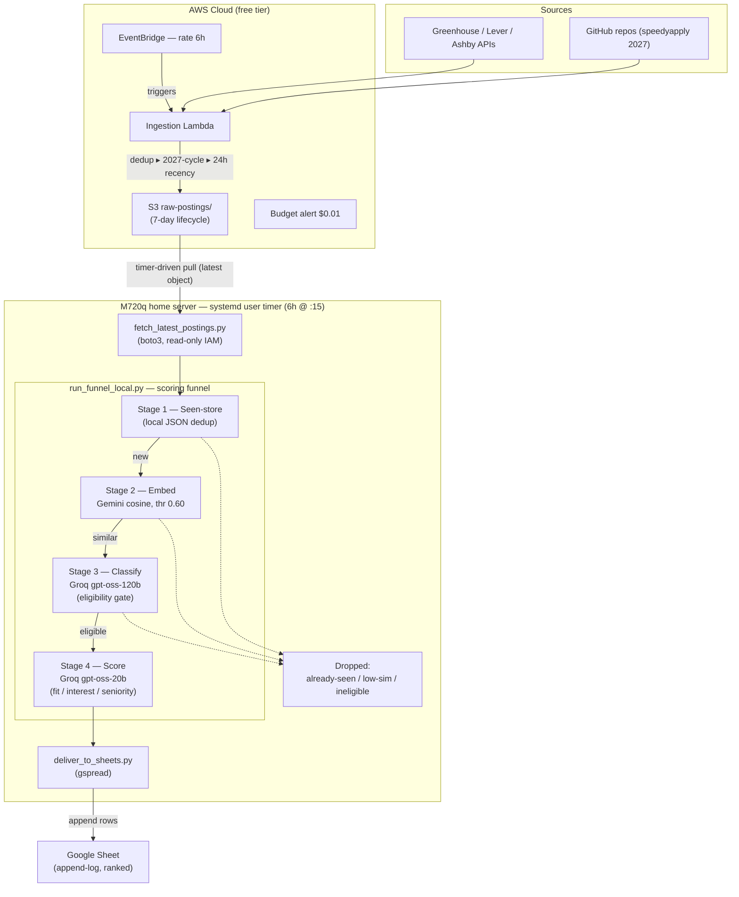

# JobRadar

An automated internship-hunting pipeline that ingests postings from company
career pages and community job boards, ranks them against a personal profile
using a multi-stage embedding + LLM funnel, and delivers the best matches to a
Google Sheet - end to end, on free tiers only.

Every 6 hours a Lambda scrapes thousands of company ATS boards plus GitHub job
repos, keeps only the last 24 hours of new US postings, and drops them in S3. A home
server then pulls that batch, runs it through a four-stage relevance funnel, and
appends the survivors to a spreadsheet ranked by fit.

---

## Architecture



The S3 object **is** the queue - there is no SQS. Ingestion is decoupled from
scoring/delivery: the cloud side only writes, the home side only reads.

### The funnel (coarse ▸ fine)

Each stage only sees the survivors of the previous one, so expensive stages run
on fewer items. Ordering is load-bearing - eligibility gating must happen
before ranking.

| Stage | File | What it does | Engine |
|-------|------|--------------|--------|
| 1 | `funnel/seen_store.py` | Drop postings already delivered (dedup across runs) | local JSON store |
| 2 | `funnel/embed_filter.py` | Coarse semantic prefilter by cosine similarity to the profile vector | Gemini `gemini-embedding-001` (768-dim) |
| 3 | `funnel/classify.py` | Eligibility gate - reject roles that are topically close but disqualified (PhD/hardware/sales/etc.) | Groq `openai/gpt-oss-120b` |
| 4 | `funnel/score.py` | Rank survivors on fit / interest / seniority | Groq `openai/gpt-oss-20b` |

Why the split: embeddings can't do negation - a PhD research role scores as
similar to a SWE role. Stage 2 is a cheap coarse net; Stage 3 is the precise
eligibility cut; Stage 4 only ranks what's already eligible. Weights for the
final score live in `score.py` (`fit 0.4, interest 0.4, seniority 0.2`), not in
the prompt, so retuning is free and doesn't bust the cache.

### Caching

Every expensive call is cached keyed by a stable id so re-runs are near-free:

- **Profile vector** - keyed by a hash of the profile prose; re-embeds only when
  you edit the profile.
- **Doc vectors** - keyed by posting id (`output/doc_vectors.json`).
- **Classifications / scores** - keyed by `hash(posting_id + profile_text)`, so
  editing the profile invalidates stale results and forces a fresh pass.

---

## Repo layout

```
schema.py                    Posting dataclass + sha256 id hashing
config/
  companies.yaml             ~6,470 validated companies -> ATS platform + slug
  repos.yaml                 GitHub job-board repos to scrape
  profile.yaml               your ideal-role prose + Stage 2 threshold
ingestion/
  ats.py                     Greenhouse / Lever / Ashby fetchers
  github_repos.py            HTML + markdown job-table parsers
funnel/
  seen_store.py              Stage 1 - cross-run dedup
  embed_filter.py            Stage 2 - embedding prefilter
  classify.py                Stage 3 - LLM eligibility gate
  score.py                   Stage 4 - LLM ranking
run_local.py                 Local ingestion -> output/postings.jsonl
run_funnel_local.py          Runs Stages 1-4 -> output/ranked.jsonl
fetch_latest_postings.py     Pull newest S3 batch -> output/postings.jsonl
deliver_to_sheets.py         Append ranked jobs to Google Sheets
run_chain.sh                 fetch -> funnel -> deliver (fail-fast)
jobradar.service / .timer    systemd units for the home-server schedule
lambda/ingestion_handler.py  AWS Lambda ingestion entry point
setup_aws.sh                 One-time AWS bootstrap (S3/IAM/Lambda/EventBridge)
reader-policy.json           Least-privilege IAM policy for the S3 reader user
```

---

## Data sources & attribution

The company-to-slug inventory in `config/companies.yaml` (~6,470 boards, every
slug validated live against its ATS API) is built from two open-source
inventories:

- **[kalil0321/ats-scrapers](https://github.com/kalil0321/ats-scrapers)** -
  MIT licensed (name, slug, and URL, so entries are attributable).
- **[Feashliaa/job-board-aggregator](https://github.com/Feashliaa/job-board-aggregator)** -
  the code is MIT, but the **board data is licensed CC-BY-NC 4.0**
  (attribution + non-commercial). Slugs sourced only from this inventory are
  labeled by their slug. This project's use is non-commercial (personal
  internship search), which is within that license; anyone reusing this data
  must preserve attribution and keep the use non-commercial.

---

## Setup

### 1. Dependencies

```bash
pip3 install -r requirements.txt
```

### 2. Secrets (`.env` at repo root)

```
GEMINI_API_KEY=...                       # Stage 2 embeddings (Google AI Studio)
GROQ_API_KEY=...                         # Stages 3 & 4 (GroqCloud, no card required)
GOOGLE_SHEETS_CREDENTIALS_PATH=...json   # service-account key file (see below)
SHEETS_SPREADSHEET_ID=...                # the id in your sheet URL between /d/ and /edit
```

`.env` and all credential keys are git-ignored.

### 3. Google Sheets delivery

1. Create a Google Cloud project and enable the **Sheets API**.
2. Create a **service account**, download its JSON key, and put the path in
   `GOOGLE_SHEETS_CREDENTIALS_PATH`.
3. **Share your target sheet** with the service account's `client_email` as an
   **Editor** (otherwise `open_by_key` returns 403).

### 4. AWS (ingestion + storage)

Run `setup_aws.sh` block by block to provision S3, the ingestion Lambda role,
the Lambda, the 6-hour EventBridge rule, and a zero-spend budget alarm. Then
create a **read-only IAM user** for the home server using `reader-policy.json`
(`s3:GetObject` + `s3:ListBucket` on the postings bucket only) and configure it
as an AWS profile named `jobradar-reader`.

---

## Running

Locally, end to end:

```bash
python3 run_local.py            # scrape sources -> output/postings.jsonl
python3 run_funnel_local.py     # Stages 1-4 -> output/ranked.jsonl
python3 deliver_to_sheets.py    # append ranked jobs to the sheet
```

Or against the live cloud batch (what the schedule does):

```bash
python3 fetch_latest_postings.py   # download newest S3 batch instead of scraping
python3 run_funnel_local.py
python3 deliver_to_sheets.py
# ...or just:
./run_chain.sh
```

Useful flags:

- `run_funnel_local.py --fresh` - reset the seen-store so every posting is
  re-evaluated (use after changing your profile or threshold).

---

## Deployment

### Cloud (AWS)

`setup_aws.sh` wires EventBridge -> Lambda -> S3. The Lambda scrapes all
sources, applies the same dedup / 2027-cycle / 24-hour filters as `run_local.py`,
and writes one JSONL object per run. A 7-day S3 lifecycle keeps storage tiny.

### Home server (M720q, systemd user timer)

The chain runs as a **user-level** systemd unit so `~/.aws`, `.env`, the
service-account key, and user-site deps all resolve under your account:

```bash
mkdir -p ~/.config/systemd/user
cp jobradar.service jobradar.timer ~/.config/systemd/user/
systemctl --user daemon-reload
systemctl --user enable --now jobradar.timer
loginctl enable-linger "$USER"      # run headless without an active login session

systemctl --user list-timers jobradar.timer
journalctl --user -u jobradar.service -e
```

The timer fires every 6 hours at `:15` (`Persistent=true`, so a missed window
runs on next boot). `run_chain.sh` is fail-fast: if the S3 fetch fails, the
funnel and delivery never run on stale data.

---

## Design notes

- **Free tier only.** Gemini embeddings (daily-resetting quota, doc-vector cache
  makes cost near-zero), Groq LLMs (no card required), AWS free tier + zero-spend
  budget alarm, Google Sheets.
- **24-hour recency + US-only filters** cut ingestion volume at the source
  (~4,600 fetched -> ~200 kept), which keeps the whole funnel comfortably under
  Groq's daily token limits by construction - the Groq load is driven by fresh
  posting volume, not company count, so scaling the board list is safe.
- **Two Groq models on separate buckets** (120b for Stage 3, 20b for Stage 4) so
  a cold backfill doesn't exhaust a single per-model daily token quota.
- **Append-log delivery.** Each run only emits newly-seen postings, so the sheet
  grows as a running record; the seen-store prevents duplicate rows.

### Known gaps

- Cross-source dedup is by `hash(company, title, location)`, so the same role
  from two sources with slightly different title punctuation can slip through;
  a URL-based key would fix it.
- The classify/score caches save once at the end of a run, so a mid-run crash
  loses the backfill (low risk now that batches are ~20 postings).
